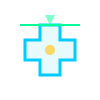
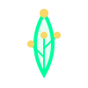

<div align="center">

<!-- ANIMATED HEADER -->


</div>

<!-- MINION MYSTERY GAME -->
<div align="center">
  <br/>
  <h3>🕹️ Play a Mini-Game: Find the hidden Minion!</h3>
  <i>(GitHub blocks Javascript, so we have to hack interactivity using dropdowns!) <br/> Can you click the right box to find Bob?</i>
  <br/><br/>
  
  <table width="80%">
    <tr>
      <td width="33%" align="center" valign="top">
        <details>
          <summary><b>📦 Mystery Box A</b></summary>
          <br/>👨‍💻 <b>HACKED!</b><br/>
          
        </details>
      </td>
      <td width="33%" align="center" valign="top">
        <details>
          <summary><b>📦 Mystery Box B</b></summary>
          <br/>🎉 <b>YOU FOUND THEM!</b><br/>
          
        </details>
      </td>
      <td width="33%" align="center" valign="top">
        <details>
          <summary><b>📦 Mystery Box C</b></summary>
          <br/>🍌 <b>WRONG MINION!</b><br/>
          
        </details>
      </td>
    </tr>
  </table>
  <br/>
</div>

<!-- ANIMATED WAVE -->


##  About Me

<table border="0" width="100%" style="border-collapse: collapse;">
<tr>
<td width="60%" valign="top">

```yaml
name: Karthik
location: India 🇮🇳
current_focus: Full Stack Web Dev + Generative AI
education: Computer Science Student
passion: Building AI-powered applications

currently:
  🔭 building: Modern web apps with AI integration
  🌱 learning: DSA in C++ | System Design
  👯 seeking: Hackathons & Open Source collabs
  ⚡ fun_fact: I debug with console.log and I'm proud of it 😄
```

</td>
<td width="40%" valign="top" align="center">
  
  <br/>
  
</td>
</tr>
</table>

<!-- ANIMATED DIVIDER -->


## 🏗️ Featured Projects

<div align="center">

<table border="1" bordercolor="#30363d" cellpadding="15" style="border-collapse: collapse;">
<tr>
<td width="50%" valign="top">
  <div align="center">
    
    <h3>DeviceDNA</h3>
    <a href="https://github.com/karthik5033/DeviceDNA"></a>
  </div>
  <br>
  <b>IoT Cybersecurity Intelligence Platform</b><br>
  Software-defined cybersecurity platform purpose-built for IoT network security and threat detection.<br><br>
  ⚡ Real-time detection &bull; 🤖 Packet analysis &bull; 🛡️ Firewall<br><br>
  <b>Tech:</b> <code>Python</code> <code>Next.js</code>
</td>
<td width="50%" valign="top">
  <div align="center">
    
    <h3>FairLearnAI</h3>
    <a href="https://github.com/karthik5033/FairLearnAI"></a>
  </div>
  <br>
  <b>AI Safety Interface for Education</b><br>
  Intelligent proxy preventing unethical use of LLMs filtering cheating and hallucinations in academia.<br><br>
  🎓 Plagiarism guard &bull; 🤖 Hallucination filter &bull; 🧠 AI limits<br><br>
  <b>Tech:</b> <code>FastAPI</code> <code>LangChain</code> <code>React</code>
</td>
</tr>

<tr>
<td width="50%" valign="top">
  <div align="center">
    
    <h3>Phishing-detector</h3>
    <a href="https://github.com/karthik5033/Phishing-detector"></a>
  </div>
  <br>
  <b>AI-Powered Threat Prediction</b><br>
  Comprehensive ML prediction app to isolate and neutralise malicious phishing URLs leveraging fast ML inference.<br><br>
  🕵️ Real-time URLs &bull; 🤖 ML inference &bull; 🌐 Fast extension<br><br>
  <b>Tech:</b> <code>Python</code> <code>Scikit-learn</code> <code>FastAPI</code>
</td>
<td width="50%" valign="top">
  <div align="center">
    
    <h3>FraudLens</h3>
    <a href="https://github.com/karthik5033/FraudLens"></a>
  </div>
  <br>
  <b>Real-time UPI Fraud Detection</b><br>
  Predictive AI model flagging refund scams, impersonation attempts, and phishing in hinges data.<br><br>
  🛡️ UPI safety &bull; 🤖 Anomaly tracking &bull; ⚡ Real-time alerts<br><br>
  <b>Tech:</b> <code>TensorFlow</code> <code>Python</code> <code>Next.js</code>
</td>
</tr>

<tr>
<td width="50%" valign="top">
  <div align="center">
    
    <h3>MedScanAI</h3>
    <a href="https://github.com/karthik5033/MedScanAI"></a>
  </div>
  <br>
  <b>Real-time AI Skin Diagnosis</b><br>
  Sophisticated medical tool using custom vision models to analyze imagery and aid dermatological assessments.<br><br>
  🩺 Live diagnostics &bull; 👁️ Custom CV &bull; 📊 Patient assessment<br><br>
  <b>Tech:</b> <code>Computer Vision</code> <code>Supabase</code> <code>Next.js</code>
</td>
<td width="50%" valign="top">
  <div align="center">
    
    <h3>AgriConnect</h3>
    <a href="https://github.com/karthik5033/AgriConnect"></a>
  </div>
  <br>
  <b>Agricultural Social Network</b><br>
  Complete, production-structured MERN stack social media application focused entirely on empowering farmers.<br><br>
  🚜 Farmer-first &bull; 🌐 Social network &bull; 📱 Responsive UI<br><br>
  <b>Tech:</b> <code>MongoDB</code> <code>React</code> <code>Node.js</code> <code>Express</code>
</td>
</tr>
</table>

</div>

<br/>

<details>
<summary><b>🔍 More Projects</b></summary>
<br/>
<div align="center">

| Project | Description | Tech |
|---------|-------------|------|
| [🧪 CompostQA](https://github.com/karthik5033/CompostQA) | Precision ML for soil health. Lab data → maturity insights | ML, Python |
| [🌀 MatterGen](https://github.com/karthik5033/MatterGen) | Discover novel stable crystals with target properties 10x faster | AI, Materials Science |
| [🎨 Parallax Card UI](https://github.com/karthik5033/parallax_card_ui) | Interactive 3D cards with mouse-hover parallax effects | Vue.js |
| [🌊 Flood-Fill Visualizer](https://github.com/karthik5033/Flood-Fill-visualizer) | Real-time algorithm visualization with dynamic animations | React, TypeScript |
| [🏗️ CodeRed-Blue-t30](https://github.com/karthik5033/CodeRed-Blue-t30) | AvatarFlowX: Draw flowcharts → AI generates web apps | AI, Full Stack |
| [🔧 Multithreaded File Scanner](https://github.com/karthik5033/multithreaded-file-scanner) | High-performance concurrent file scanning utility | C++ |

</div>
</details>

<!-- ANIMATED DIVIDER -->


##  Tech Stack


<div align="center">

### ⚡ Languages


### 🎨 Frontend


### ⚙️ Backend & Database


### 🛠️ Tools & Other


</div>

<!-- ANIMATED DIVIDER -->


##  GitHub Analytics


<div align="center">


<br/><br/>

<!-- STREAK STATS -->


<br/><br/>

<!-- ACTIVITY GRAPH -->


</div>


<!-- ANIMATED DIVIDER -->


## 👾 Contribution Matrix

<div align="center">
  <br/>
  
</div>

<!-- ANIMATED DIVIDER -->


## 🤝 Let's Connect

<div align="center">

<a href="https://github.com/karthik5033" target="_blank">

</a>
<a href="mailto:karthik5033@gmail.com" target="_blank">

</a>

<br/><br/>

 <b style="vertical-align: middle; color: #8B949E; font-size: 16px;">I love connecting with different people</b>, so if you want to say <b>hi, I'll be happy to meet you!</b> 😊

<br/><br/>
### ⭐ Show some love by starring my repos!

</div>
