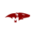

<div align="center">

<!-- ANIMATED HEADER -->


</div>

<!-- MINION MYSTERY GAME .-->
<div align="center">
  <br/>
  <h3>🕹️ Play a Mini-Game: Find the hidden Minion!</h3>
  <i>Only the most curious developers will find Bob... <br/> Dare to open a mystery box?</i>
  <br/><br/>
  
  <table width="80%">
    <tr>
      <td width="33%" align="center" valign="top">
        <details>
          <summary><b>📦 Mystery Box A</b></summary>
          <br/>👨‍💻 <b>Wrong one !</b><br/>
          
        </details>
      </td>
      <td width="33%" align="center" valign="top">
        <details>
          <summary><b>📦 Mystery Box B</b></summary>
          <br/>🎉 <b>YOU FOUND THEM!</b><br/>
          
        </details>
      </td>
      <td width="33%" align="center" valign="top">
        <details>
          <summary><b>📦 Mystery Box C</b></summary>
          <br/>🍌 <b>WRONG MINION!</b><br/>
          
        </details>
      </td>
    </tr>
  </table>
  <br/>
</div>

<!-- ANIMATED WAVE -->


##  About Me

<table border="0" width="100%" style="border-collapse: collapse;">
<tr>
<td width="60%" valign="top">

```yaml
name: Karthik
location: Bangalore, India 🇮🇳
current_focus: Full Stack Web Dev + Generative AI
education: Computer Science @ RVCE (ISE-28)
passion: Building AI-powered applications
currently:
  🔭 building: Modern web apps with AI integration
  🌱 learning: DSA in C++ | System Design
  👯 seeking: Hackathons & Open Source collabs
  🍌 motto: "Bello!" — ship fast, break nothing
  ⚡ fun_fact: I debug with console.log and I'm proud of it 😄
```

<table border="1" bordercolor="#30363d" cellpadding="5" cellspacing="0" width="100%" style="border-collapse: collapse; border-radius: 6px;">
  <tr>
    <td align="center" valign="middle" bgcolor="#0d1117" height="45">
      
    </td>
  </tr>
</table>

</td>
<td width="40%" valign="top" align="center">
  
  <br/>
  
</td>
</tr>
</table>

<!-- ANIMATED DIVIDER -->


## 🏗️ Featured Projects

<div align="center">

<table border="1" bordercolor="#30363d" cellpadding="15" width="100%" style="border-collapse: collapse;">
<tr>
  <td width="50%" valign="top">
    
    <a href="https://github.com/karthik5033/DeviceDNA" style="text-decoration: none; font-size: 16px;"><b>DeviceDNA</b></a><br>
    <span style="font-size: 13px; color: #c9d1d9;">IoT Cybersecurity Platform</span><br>
    <p style="font-size: 12px; color: #8b949e; margin: 6px 0;">Software-defined cybersecurity platform purpose-built for IoT point-networks to actively detect, analyze, and isolate system anomalies.</p>
    <span style="font-size: 11px; color: #58a6ff;">Python &bull; Next.js</span>
  </td>
  <td width="50%" valign="top">
    
    <a href="https://github.com/karthik5033/FairLearnAI" style="text-decoration: none; font-size: 16px;"><b>FairLearnAI</b></a><br>
    <span style="font-size: 13px; color: #c9d1d9;">AI Safety Interface for Education</span><br>
    <p style="font-size: 12px; color: #8b949e; margin: 6px 0;">An intelligent API proxy intercepting unethical LLM usages, effectively filtering academic cheating and systemic AI hallucinations.</p>
    <span style="font-size: 11px; color: #58a6ff;">FastAPI &bull; LangChain &bull; React</span>
  </td>
</tr>

<tr>
  <td width="50%" valign="top">
    
    <a href="https://github.com/karthik5033/Phishing-detector" style="text-decoration: none; font-size: 16px;"><b>Phishing-detector</b></a><br>
    <span style="font-size: 13px; color: #c9d1d9;">AI-Powered Threat Prediction</span><br>
    <p style="font-size: 12px; color: #8b949e; margin: 6px 0;">Comprehensive real-time browser extension that leverages fast supervised ML inference to instantly neutralize malicious domains.</p>
    <span style="font-size: 11px; color: #58a6ff;">Python &bull; FastAPI &bull; Scikit-learn</span>
  </td>
  <td width="50%" valign="top">
    
    <a href="https://github.com/karthik5033/MedScanAI" style="text-decoration: none; font-size: 16px;"><b>MedScanAI</b></a><br>
    <span style="font-size: 13px; color: #c9d1d9;">Real-time AI Skin Diagnosis</span><br>
    <p style="font-size: 12px; color: #8b949e; margin: 6px 0;">Sophisticated diagnostic aid tool utilizing custom robust computer vision models to precisely analyze patient dermatological imagery.</p>
    <span style="font-size: 11px; color: #58a6ff;">Computer Vision &bull; Supabase &bull; Next.js</span>
  </td>
</tr>

<tr>
  <td width="50%" valign="top">
    
    <a href="https://github.com/karthik5033/AgriConnect" style="text-decoration: none; font-size: 16px;"><b>AgriConnect</b></a><br>
    <span style="font-size: 13px; color: #c9d1d9;">Agricultural Social Network</span><br>
    <p style="font-size: 12px; color: #8b949e; margin: 6px 0;">A tightly-coupled production MERN stack network empowering farmers with essential peer communication and regional advisories.</p>
    <span style="font-size: 11px; color: #58a6ff;">MongoDB &bull; React &bull; Node.js</span>
  </td>
  <td width="50%" valign="top">
    
    <a href="https://github.com/karthik5033/CompostQA" style="text-decoration: none; font-size: 16px;"><b>CompostQA</b></a><br>
    <span style="font-size: 13px; color: #c9d1d9;">Precision ML for Soil Health</span><br>
    <p style="font-size: 12px; color: #8b949e; margin: 6px 0;">Analytical predictive system mapping complex laboratory inputs to robust compost maturity insights via machine learning data layers.</p>
    <span style="font-size: 11px; color: #58a6ff;">Machine Learning &bull; Python</span>
  </td>
</tr>

<tr>
  <td width="50%" valign="top">
    
    <a href="https://github.com/karthik5033/MatterGen" style="text-decoration: none; font-size: 16px;"><b>MatterGen</b></a><br>
    <span style="font-size: 13px; color: #c9d1d9;">Discover Novel Stable Crystals</span><br>
    <p style="font-size: 12px; color: #8b949e; margin: 6px 0;">Framework accelerating novel stable crystalline structure discovery, massively improving testing workflows through generative architecture.</p>
    <span style="font-size: 11px; color: #58a6ff;">AI &bull; Materials Science</span>
  </td>
  <td width="50%" valign="top">
    
    <a href="https://github.com/karthik5033/CodeRed-Blue-t30" style="text-decoration: none; font-size: 16px;"><b>AvatarFlowX</b></a><br>
    <span style="font-size: 13px; color: #c9d1d9;">Draw Flowcharts → AI Generates Web Apps</span><br>
    <p style="font-size: 12px; color: #8b949e; margin: 6px 0;">Fully-autonomous generative pipeline translating raw user-drawn application flowcharts into functional, production-ready web apps.</p>
    <span style="font-size: 11px; color: #58a6ff;">Generative AI &bull; Full Stack</span>
  </td>
</tr>
</table>

</div>

<br/>

<details>
<summary><b>🔍 More Projects</b></summary>
<br/>
<div align="center">

| Project | Description | Tech |
|---------|-------------|------|
| [🎨 Parallax Card UI](https://github.com/karthik5033/parallax_card_ui) | Interactive 3D cards with mouse-hover parallax effects | Vue.js |
| [🌊 Flood-Fill Visualizer](https://github.com/karthik5033/Flood-Fill-visualizer) | Real-time algorithm visualization with dynamic animations | React, TypeScript |
| [🔧 Multithreaded File Scanner](https://github.com/karthik5033/multithreaded-file-scanner) | High-performance concurrent file scanning utility | C++ |

</div>
</details>

<!-- ANIMATED DIVIDER -->


##  Achievements & Hackathons

<div align="center">

<table border="1" bordercolor="#30363d" cellpadding="15" width="100%" style="border-collapse: collapse;">
<tr>
  <td width="50%" valign="top">
    <div style="font-size: 45px; float: left; margin-right: 15px;">🥉</div>
    <b style="font-size: 16px; color: #FFD93D;">3rd Place — Space Tech National Hackathon</b><br>
    <span style="font-size: 13px; color: #c9d1d9;">Category: Solid Waste Management</span><br>
    <p style="font-size: 12px; color: #8b949e; margin: 6px 0;">Secured 3rd place overall at the prestigious national-level space tech hackathon in Bengaluru.</p>
    <span style="font-size: 11px; color: #58a6ff;">March 2026 &bull; Bengaluru</span>
  </td>
  <td width="50%" valign="top">
    <div style="font-size: 45px; float: left; margin-right: 15px;">🥈</div>
    <b style="font-size: 16px; color: #e3e4e5;">2nd Place — Algorithm Roulette</b><br>
    <span style="font-size: 13px; color: #c9d1d9;">Varnotsava National Level Hackathon</span><br>
    <p style="font-size: 12px; color: #8b949e; margin: 6px 0;">Showcased exceptional DSA and algorithmic problem-solving skills to secure the runner-up position.</p>
    <span style="font-size: 11px; color: #58a6ff;">SMVITM</span>
  </td>
</tr>
</table>

</div>

<!-- ANIMATED DIVIDER -->


##  Tech Stack


<div align="center">

### ⚡ Languages


### 🎨 Frontend


### ⚙️ Backend & Database


### 🛠️ Tools & Other


</div>

<!-- ANIMATED DIVIDER -->


##  GitHub Analytics


<div align="center">

<table border="0" cellpadding="0" cellspacing="0" width="100%">
<tr>
  <td width="50%" align="center" valign="middle">
    
  </td>
  <td width="50%" align="center" valign="middle">
    
  </td>
</tr>
</table>

<br/><br/>

<!-- STREAK STATS -->


<br/><br/>

<!-- ACTIVITY GRAPH (locally generated from real GitHub data) -->


</div>


<!-- ANIMATED DIVIDER -->


## 👾 Contribution Matrix

<div align="center">
  <br/>
  
</div>

<!-- ANIMATED DIVIDER -->


## 🤝 Let's Connect

<div align="center">

<a href="https://github.com/karthik5033" target="_blank">

</a>
<a href="mailto:karthik5033@gmail.com" target="_blank">

</a>

<br/><br/>

 <b style="vertical-align: middle; color: #8B949E; font-size: 16px;">I love connecting with different people</b>, so if you want to say <b>hi, I'll be happy to meet you!</b> 😊

<br/><br/>
### ⭐ Show some love by starring my repos!

</div>
