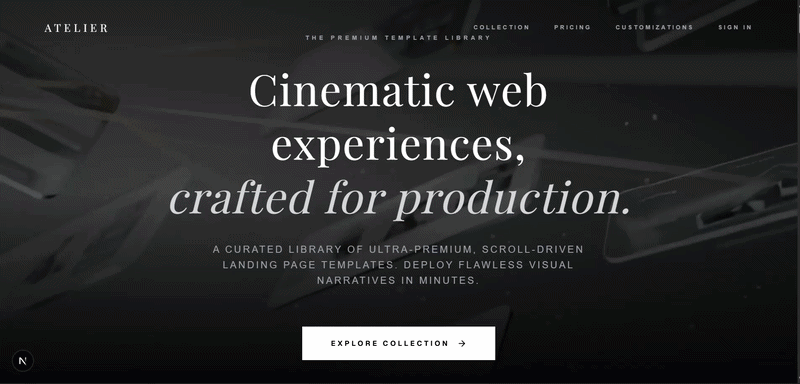

<div align="center">

<!-- ANIMATED HEADER -->


</div>

<!-- MINION MYSTERY GAME .-->
<div align="center">
  <br/>
  <h3>🕹️ Play a Mini-Game: Find the hidden Minion</h3>
  <i>Only the most curious developers will find Bob... <br/> Dare to open a mystery box ?</i>
  <br/><br/>
  
  <table width="80%">
    <tr>
      <td width="33%" align="center" valign="top">
        <details>
          <summary><b>📦 Mystery Box A</b></summary>
          <br/>👨‍💻 <b>Wrong one !</b><br/>
          
        </details>
      </td>
      <td width="33%" align="center" valign="top">
        <details>
          <summary><b>📦 Mystery Box B</b></summary>
          <br/>🎉 <b>YOU FOUND THEM</b><br/>
          
        </details>
      </td>
      <td width="33%" align="center" valign="top">
        <details>
          <summary><b>📦 Mystery Box C</b></summary>
          <br/>🍌 <b>WRONG MINION!</b><br/>
          
        </details>
      </td>
    </tr>
  </table>
  <br/>
</div>

<!-- ANIMATED WAVE -->


##  About Me

<table border="0" width="100%" style="border-collapse: collapse;">
<tr>
<td width="60%" valign="top">

```yaml
name: Karthik K P
location: Bangalore, India 🇮🇳
current_focus: Full Stack Web Dev + Generative AI
education: Information Science Engineering @ RVCE (ISE-28)
passion: Building AI-powered applications
currently:
  🔭 building: Modern web apps with AI integration
  🌱 learning: DSA in C++ | System Design
  👯 seeking: Hackathons & Open Source collabs
  🍌 motto: "Bello!" — ship fast, break nothing
  ⚡ fun_fact: I debug with console.log and I'm proud of it 😄
```

<table border="1" bordercolor="#30363d" cellpadding="5" cellspacing="0" width="100%" style="border-collapse: collapse; border-radius: 6px;">
  <tr>
    <td align="center" valign="middle" bgcolor="#0d1117" height="45">
      
    </td>
  </tr>
</table>

</td>
<td width="40%" valign="top" align="center">
  
  <br/>
  
</td>
</tr>
</table>

<br>
<div style="padding: 15px; border-radius: 8px; border: 1px solid #30363d; background: #0d1117;">
  <table border="0" cellpadding="0" cellspacing="0" width="100%">
    <tr>
      <td width="65%" valign="top" style="padding-right: 15px;">
        <h3 style="margin-top: 0; color: #58a6ff;">🚀 Startup Journey</h3>
        I'm currently building <b><a href="https://github.com/karthik5033/ATELIER" style="color: #e6edf3; text-decoration: none;">ATELIER</a></b> as a startup! 
        It's a premium, curated storefront for ultra-high-end landing page templates featuring cinematic, scroll-synced image sequences for an immersive experience. <br><br>
        👉 <a href="https://landing-page-store-zeta.vercel.app"></a>
      </td>
      <td width="35%" valign="middle" align="center">
        <a href="https://landing-page-store-zeta.vercel.app"></a>
      </td>
    </tr>
  </table>
</div>

<!-- ANIMATED DIVIDER -->


## 🏗️ Featured Projects

<div align="center">

<table border="1" bordercolor="#30363d" cellpadding="15" width="100%" style="border-collapse: collapse;">
<tr>
  <td width="50%" valign="top">
    
    <a href="https://github.com/karthik5033/DeviceDNA" style="text-decoration: none; font-size: 16px;"><b>DeviceDNA</b></a><br>
    <span style="font-size: 13px; color: #c9d1d9;">IoT Cybersecurity Platform</span><br>
    <p style="font-size: 12px; color: #8b949e; margin: 6px 0;">Software-defined cybersecurity platform purpose-built for IoT point-networks to actively detect, analyze, and isolate system anomalies.</p>
    <div style="clear: both;"></div>
    <span style="font-size: 11px; color: #58a6ff;">Python &bull; Next.js</span>
  </td>
  <td width="50%" valign="top">
    
    <a href="https://github.com/karthik5033/BioCrypt" style="text-decoration: none; font-size: 16px;"><b>BioCrypt</b></a>
    <a href="https://bio-crypt.vercel.app"></a><br>
    <span style="font-size: 13px; color: #c9d1d9;">DNA-based File Encryption</span><br>
    <p style="font-size: 12px; color: #8b949e; margin: 6px 0;">A file encryption system where data is encoded as DNA sequences, encrypted via controlled biological mutations, and recovered from corruption using sequence alignment algorithms.</p>
    <div style="clear: both;"></div>
    <span style="font-size: 11px; color: #58a6ff;">TypeScript</span>
  </td>
</tr>

<tr>
  <td width="50%" valign="top">
    
    <a href="https://github.com/karthik5033/Phishing-detector" style="text-decoration: none; font-size: 16px;"><b>Secure-Sentinel</b></a><br>
    <span style="font-size: 13px; color: #c9d1d9;">AI-Powered Threat Prediction</span><br>
    <p style="font-size: 12px; color: #8b949e; margin: 6px 0;">Comprehensive real-time browser extension that leverages fast supervised ML inference to instantly neutralize malicious domains.</p>
    <div style="clear: both;"></div>
    <span style="font-size: 11px; color: #58a6ff;">Python &bull; FastAPI &bull; Scikit-learn</span>
  </td>
  <td width="50%" valign="top">
    
    <a href="https://github.com/karthik5033/OncoVision" style="text-decoration: none; font-size: 16px;"><b>OncoVision</b></a><br>
    <span style="font-size: 13px; color: #c9d1d9;">AI Brain Tumor Forecasting</span><br>
    <p style="font-size: 12px; color: #8b949e; margin: 6px 0;">AI-powered brain tumor progression forecasting system that segments MRI scans, predicts growth trajectories, and simulates treatment decisions.</p>
    <div style="clear: both;"></div>
    <span style="font-size: 11px; color: #58a6ff;">Computer Vision &bull; Python</span>
  </td>
</tr>

<tr>
  <td width="50%" valign="top">
    
    <a href="https://github.com/karthik5033/linked-list-visual-debugger" style="text-decoration: none; font-size: 16px;"><b>Linked List Debugger</b></a>
    <a href="https://linked-list-visual-debugger.vercel.app"></a><br>
    <span style="font-size: 13px; color: #c9d1d9;">Visual Algorithm Tool</span><br>
    <p style="font-size: 12px; color: #8b949e; margin: 6px 0;">An interactive, visual debugging environment for linked list operations to help developers understand memory management.</p>
    <div style="clear: both;"></div>
    <span style="font-size: 11px; color: #58a6ff;">JavaScript &bull; Data Structures</span>
  </td>
  <td width="50%" valign="top">
    
    <a href="https://github.com/karthik5033/CompostQA" style="text-decoration: none; font-size: 16px;"><b>CompostQA</b></a>
    <a href="https://compost-qa-pro.vercel.app"></a><br>
    <span style="font-size: 13px; color: #c9d1d9;">Precision ML for Soil Health</span><br>
    <p style="font-size: 12px; color: #8b949e; margin: 6px 0;">Analytical predictive system mapping complex laboratory inputs to robust compost maturity insights via machine learning data layers.</p>
    <div style="clear: both;"></div>
    <span style="font-size: 11px; color: #58a6ff;">Machine Learning &bull; Python</span>
  </td>
</tr>

<tr>
  <td width="50%" valign="top">
    
    <a href="https://github.com/karthik5033/MatterGen" style="text-decoration: none; font-size: 16px;"><b>MatterGen</b></a><br>
    <span style="font-size: 13px; color: #c9d1d9;">Discover Novel Stable Crystals</span><br>
    <p style="font-size: 12px; color: #8b949e; margin: 6px 0;">Framework accelerating novel stable crystalline structure discovery, massively improving testing workflows through generative architecture.</p>
    <div style="clear: both;"></div>
    <span style="font-size: 11px; color: #58a6ff;">AI &bull; Materials Science</span>
  </td>
  <td width="50%" valign="top">
    
    <a href="https://github.com/karthik5033/CodeRed-Blue-t30" style="text-decoration: none; font-size: 16px;"><b>AvatarFlowX</b></a><br>
    <span style="font-size: 13px; color: #c9d1d9;">Draw Flowcharts → AI Generates Web Apps</span><br>
    <p style="font-size: 12px; color: #8b949e; margin: 6px 0;">Fully-autonomous generative pipeline translating raw user-drawn application flowcharts into functional, production-ready web apps.</p>
    <div style="clear: both;"></div>
    <span style="font-size: 11px; color: #58a6ff;">Generative AI &bull; Full Stack</span>
  </td>
</tr>
<tr>
  <td width="50%" valign="top">
    
    <a href="https://github.com/karthik5033/AstraSky" style="text-decoration: none; font-size: 16px;"><b>AstraSky</b></a>
    <a href="https://swm-digital-twin.vercel.app/"></a><br>
    <span style="font-size: 13px; color: #c9d1d9;">Waste Ecosystem Simulation</span><br>
    <p style="font-size: 12px; color: #8b949e; margin: 6px 0;">A policy simulation AI platform mapping waste ecosystems using satellite intelligence, predicting illegal dumping, and modeling emissions.</p>
    <div style="clear: both;"></div>
    <span style="font-size: 11px; color: #58a6ff;">TypeScript &bull; AI</span>
  </td>
  <td width="50%" valign="top">
    
    <a href="https://github.com/karthik5033/Super-Mario-Game" style="text-decoration: none; font-size: 16px;"><b>Super Mario</b></a>
    <a href="https://super-mario-game-eight.vercel.app"></a><br>
    <span style="font-size: 13px; color: #c9d1d9;">Evolution of Computing Platformer</span><br>
    <p style="font-size: 12px; color: #8b949e; margin: 6px 0;">A 2D platformer taking players on a journey through the evolution of computing with dynamically generated levels rendered on HTML5 Canvas.</p>
    <div style="clear: both;"></div>
    <span style="font-size: 11px; color: #58a6ff;">TypeScript &bull; HTML5 Canvas</span>
  </td>
</tr>
<tr>
  <td width="50%" valign="top">
    
    <a href="https://github.com/karthik5033/Cephus" style="text-decoration: none; font-size: 16px;"><b>Trial AI</b></a><br>
    <span style="font-size: 13px; color: #c9d1d9;">AI Fairness Courtroom</span><br>
    <p style="font-size: 12px; color: #8b949e; margin: 6px 0;">An adversarial, multi-agent AI courtroom pitting LLMs against model predictions to identify proxy variables and disparate impact.</p>
    <div style="clear: both;"></div>
    <span style="font-size: 11px; color: #58a6ff;">Python &bull; Generative AI</span>
  </td>
  <td width="50%" valign="top">
    
    <a href="https://github.com/karthik5033/multithreaded-file-scanner" style="text-decoration: none; font-size: 16px;"><b>Multithreaded Scanner</b></a><br>
    <span style="font-size: 13px; color: #c9d1d9;">High-Performance Concurrency</span><br>
    <p style="font-size: 12px; color: #8b949e; margin: 6px 0;">A high-performance concurrent file scanning utility built in C++ that leverages multithreading for rapid filesystem traversal and analysis.</p>
    <div style="clear: both;"></div>
    <span style="font-size: 11px; color: #58a6ff;">C++</span>
  </td>
</tr>
<tr>
  <td width="50%" valign="top">
    
    <a href="https://github.com/karthik5033/FairLearnAI" style="text-decoration: none; font-size: 16px;"><b>FairLearn AI</b></a>
    <a href="https://fair-learn-ai.vercel.app"></a><br>
    <span style="font-size: 13px; color: #c9d1d9;">AI Bias Mitigation</span><br>
    <p style="font-size: 12px; color: #8b949e; margin: 6px 0;">An advanced machine learning framework designed to evaluate, visualize, and mitigate bias in predictive models.</p>
    <div style="clear: both;"></div>
    <span style="font-size: 11px; color: #58a6ff;">Python &bull; AI Fairness</span>
  </td>
  <td width="50%" valign="top">
    
    <a href="https://github.com/karthik5033/AgriConnect" style="text-decoration: none; font-size: 16px;"><b>AgriConnect</b></a><br>
    <span style="font-size: 13px; color: #c9d1d9;">Smart Farming Network</span><br>
    <p style="font-size: 12px; color: #8b949e; margin: 6px 0;">A comprehensive ecosystem connecting farmers to market data, providing weather insights, and optimizing supply chain operations.</p>
    <div style="clear: both;"></div>
    <span style="font-size: 11px; color: #58a6ff;">Full Stack &bull; IoT</span>
  </td>
</tr>
</table>

</div>

<br/>

<details>
<summary><b>🔍 More Projects</b></summary>
<br/>
<div align="center">

| Project | Description | Tech |
|---------|-------------|------|
| [🎨 Parallax Card UI](https://github.com/karthik5033/parallax_card_ui) | Interactive 3D cards with mouse-hover parallax effects | Vue.js |
| [🌊 Flood-Fill Visualizer](https://github.com/karthik5033/Flood-Fill-visualizer) | Real-time algorithm visualization with dynamic animations | React, TypeScript |
| [🔧 Multithreaded File Scanner](https://github.com/karthik5033/multithreaded-file-scanner) | High-performance concurrent file scanning utility | C++ |

</div>
</details>

<!-- ANIMATED DIVIDER -->


##  Achievements & Hackathons

<div align="center">

<table border="1" bordercolor="#30363d" cellpadding="15" width="100%" style="border-collapse: collapse;">
<tr>
  <td width="50%" valign="top">
    <div style="font-size: 45px; float: left; margin-right: 15px;">🥉</div>
    <b style="font-size: 16px; color: #FFD93D;">3rd Place — Space Tech National Hackathon</b><br>
    <span style="font-size: 13px; color: #c9d1d9;">Category: Solid Waste Management</span><br>
    <p style="font-size: 12px; color: #8b949e; margin: 6px 0;">Secured 3rd place overall at the prestigious national-level space tech hackathon in Bengaluru.</p>
    <div style="clear: both;"></div>
    <span style="font-size: 11px; color: #58a6ff;">March 2026 &bull; Bengaluru</span>
  </td>
  <td width="50%" valign="top">
    <div style="font-size: 45px; float: left; margin-right: 15px;">🥈</div>
    <b style="font-size: 16px; color: #e3e4e5;">2nd Place — Algorithm Roulette</b><br>
    <span style="font-size: 13px; color: #c9d1d9;">Varnotsava National Level Hackathon</span><br>
    <p style="font-size: 12px; color: #8b949e; margin: 6px 0;">Showcased exceptional DSA and algorithmic problem-solving skills to secure the runner-up position.</p>
    <div style="clear: both;"></div>
    <span style="font-size: 11px; color: #58a6ff;">SMVITM</span>
  </td>
</tr>
</table>

</div>

<!-- ANIMATED DIVIDER -->


##  Tech Stack


<div align="center">

### ⚡ Languages


### 🎨 Frontend


### ⚙️ Backend & Database


### 🛠️ Tools & Other


### 🤖 AI, ML & Data Science


</div>

<!-- ANIMATED DIVIDER -->


##  GitHub Analytics


<div align="center">

<table border="0" cellpadding="0" cellspacing="0" width="100%">
<tr>
  <td width="50%" align="center" valign="middle">
    
  </td>
  <td width="50%" align="center" valign="middle">
    
  </td>
</tr>
</table>

<br/><br/>

<!-- STREAK STATS -->


<br/><br/>

<!-- ACTIVITY GRAPH (locally generated from real GitHub data) -->


</div>


<!-- ANIMATED DIVIDER -->


## 👾 Contribution Matrix

<div align="center">
  <br/>
  
</div>

<!-- ANIMATED DIVIDER -->


## 🤝 Let's Connect

<div align="center">

<a href="https://github.com/karthik5033" target="_blank">

</a>
<a href="mailto:karthik5033@gmail.com" target="_blank">

</a>

<br/><br/>

 <b style="vertical-align: middle; color: #8B949E; font-size: 16px;">I love connecting with different people</b>, so if you want to say <b>hi, I'll be happy to meet you!</b> 😊

<br/><br/>
### ⭐ Show some love by starring my repos!

</div>
